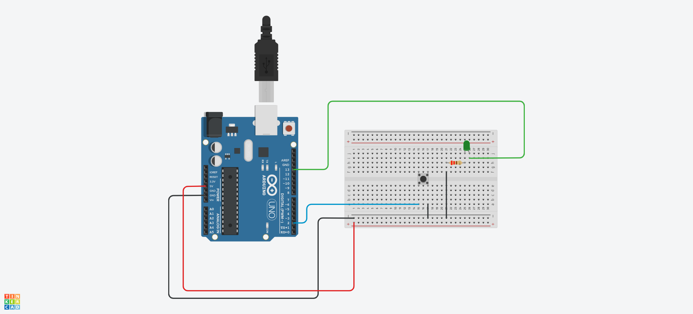

# acendeLedBotao

- [x] Desenvolver um circuto no arduino uno com um led externo ligado a placa ou utilizar o led padrão na porta 13.
- [x] Adicionar a esse circuito um push button.

 

> Layout do circuito criado.

 

- [x] Desenvolver o código para acender o led somente quando o push button for pressionado.