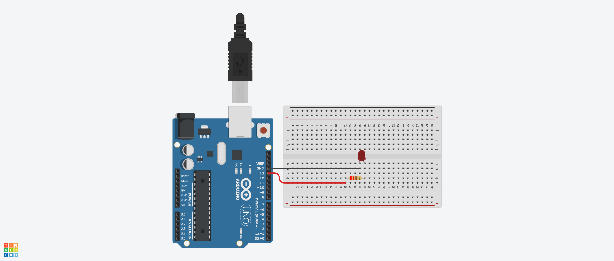

# blinkSemDelay

- [x] Desenvolver um circuto no arduino uno com um led externo ligado a placa ou utilizar o led padrão na porta 13.

 

> Layout do circuito criado.

 

- [x] Desenvolver o código para realizar o 'blink' ou piscada do led sem utilizar a função delay().